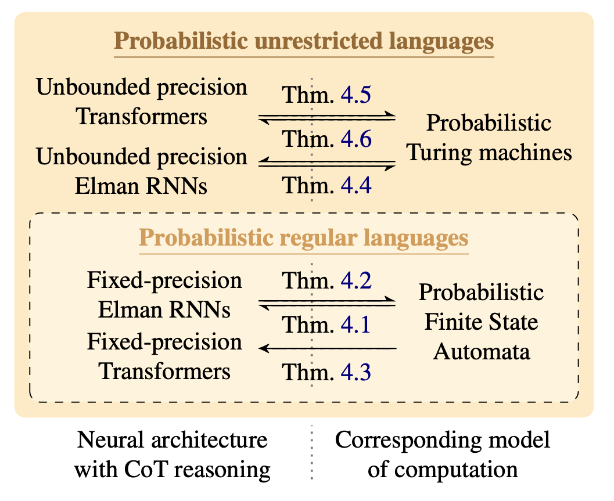
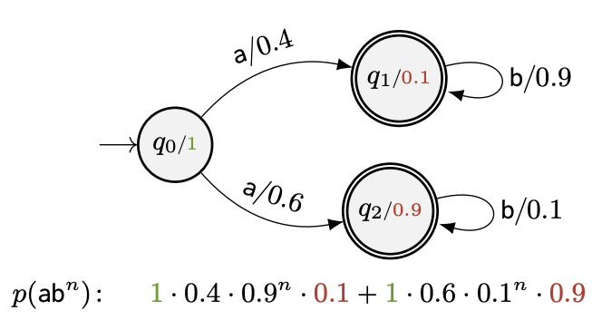
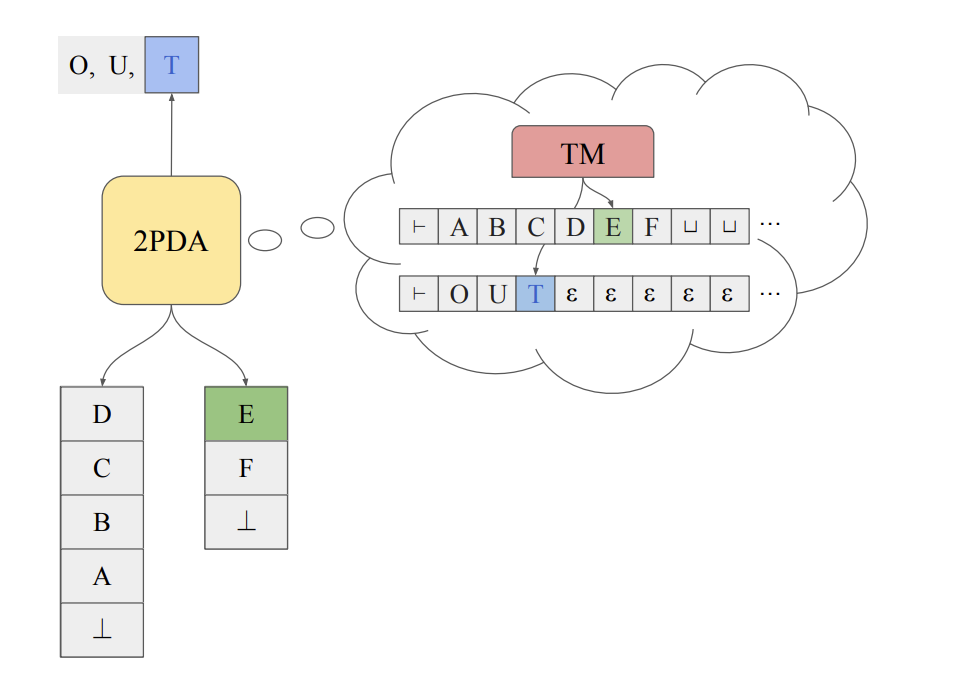
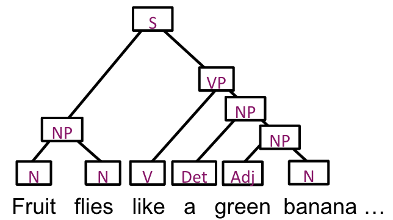

## About
I am a first-year PhD student in Natural Language Processing at ETH Zürich, working at [rycolab](https://rycolab.io/) with [Ryan Cotterell](https://rycolab.io/authors/ryan/). I did my undergraduate in Computer Science at Cambridge followed by two years working in the software industry, before returing to ETH for a masters degree and PhD.

In my research I mainly focus on using formal languages and computation theory to explore the capabilities of different LLM architectures.

## Interests
* Formal language theory applied to neural LMs (e.g. showing that [transformers can recognize palindromes](/assets/documents/Palindrome_Transformer.pdf))
* Biologically inspired machine learning (like [predictive coding](/assets/documents/Predictive_Coding.pdf))

## News
* *Oct 2024* - Two papers accepted at EMNLP 2024 in Miami: [Prediciting Surprisal Curves of Discourse](https://arxiv.org/abs/2410.16062) and A New Algorithm for Learning Deterministic FSAs
* *Sep 2024* - [AICoffeeBreak interview](https://youtu.be/MMIJKKNxvec) about Turing completeness of neural language models
* *Aug 2024* - [ACL 2024 Tutorial](https://acl2024.ivia.ch) on neural language model expressivity
* *May 2024* - Two papers accepted at ACL 2024 in Bangkok: [Expressivity of CoT Reasoning](https://arxiv.org/abs/2406.14197) and [Learnability of Probabilistic Languages](https://arxiv.org/abs/2406.04289)
* *Mar 2024* - Paper accepted at NAACL 2024 in Mexico City: [Encoding PFSAs in RNNs](https://aclanthology.org/2024.naacl-long.380/) 

## Selected Publications

### On the Representational Capacity of Neural Language Models with Chain-of-Thought Reasoning
*ACL 2024*\\
**Franz Nowak**\*, Anej Svete\*, Alexandra Butoi, and Ryan Cotterell

[{: width="75%"}](https://arxiv.org/abs/2406.14197)

Large Language Models (LLM) have been shown to be better at logical reasoning when allowed to output additional tokens. This is known as Chain-of-Thought (CoT) reasoning. We investigate formally how much more powerful Transformer and RNN language models get when doing CoT reasoning compared to real-time generation. We find that Transformers and RNNs with fixed precision can simulate probabilistic FSAs, while with unbounded precision they are able to simulate probabilistic Turing machines.

### Lower Bounds on the Expressivity of Recurrent Neural Language Models
*NAACL 2024*\\
Anej Svete\*, **Franz Nowak**\*, Anisha Mohamed Sahabdeen, and Ryan Cotterell

[{: width="75%"}](https://arxiv.org/abs/2405.19222)

Recurrent Neural Networks (RNNs) are more expressive than Transformers as they can keep state over arbitrarily long sequences.
This means RNNs, unlike Transformers, can simulate non-deterministic probabilistic finite-state automata (PFSAs) in real time.
We show this by construction, providing the weights required for PFSAs to be encoded in an RNN language model.

### On the Representational Capacity of Recurrent Neural Language Models
*EMNLP 2023*\\
**Franz Nowak**, Anej Svete, Li Du, and Ryan Cotterell

[{: width="75%"}](https://arxiv.org/abs/2310.12942)

RNN language models are starting to make a comeback in NLP, showing performance equaling that of Transformers. In this work, we investigate the types of language distributions that can be expressed by RNN language models. We find that when allowed additional empty tokens, RNNs can simulate a certain type of probabilistic Turing machine, while without, their expressivity is upper bounded by real-time probabilistic Turing machines.

### A Fast Algorithm for Computing Prefix Probabilities
*ACL 2023*\\
**Franz Nowak** and Ryan Cotterell

[{: width="75%"}](https://arxiv.org/abs/2306.02303)

The first language models were based on prefix-parsing Probabilistic Context-Free Grammars (PCFGs). 
The classic algorithm for this task is based on the famous CKY-Algorithm. However, it is not optimally efficient with respect to the grammar size.
This paper proposes a speedup of this classic algorithm, resulting in better asymptotic complexity in terms of the size of the grammar.